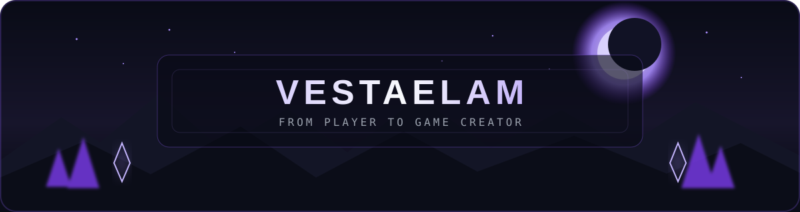

<div align="center">



<a href="https://git.io/typing-svg">
  
</a>

`Студент` · `Начинающий разработчик` · `Будущий game developer`

</div>

## Обо мне

Я **VestaElam**, студент 2 курса направления «Прикладная информатика» в Крымском инженерно-педагогическом университете имени Февзи Якубова.

- На первом курсе изучал основы программирования на **C++**.
- Сейчас осваиваю **HTML** и **CSS**.
- Больше всего меня привлекает **разработка игр** — хочу пройти путь от первых учебных работ до собственных игровых проектов.
- В планах: создать свой сайт и заняться разработкой сервера для Minecraft.

## Навыки и технологии

<div align="center">


</div>

| Уже знаком | Изучаю сейчас | Хочу освоить |
|:---:|:---:|:---:|
| C++, основы программирования | HTML, CSS, Git и GitHub | Game development, игровые движки, создание игровых миров |

## Мой путь

```text
[ C++ и алгоритмическое мышление ]
                 ↓
[ HTML + CSS и первый собственный сайт ]
                 ↓
[ Minecraft-сервер и работа над игровым сообществом ]
                 ↓
[ Собственные игры ]
```

## Учебные работы

### [Лабораторные работы по C++](https://github.com/VestaElam/cpp-labs)

Мои первые программы и практические задания на C++. Репозиторий отражает начало пути в программировании и будет дополняться описаниями решённых задач.

## Немного вне кода

Люблю игры с сильными мирами и историями. Особенно вдохновляют игры **CD PROJEKT RED** и серия **«Ведьмак»**. Также играю в **Minecraft** и **Roblox**, читаю мангу и смотрю аниме — всё это развивает интерес к игровым мирам, атмосфере и созданию собственных проектов.

## Ближайшие цели

- [ ] Уверенно освоить HTML и CSS
- [ ] Создать и опубликовать первый сайт
- [ ] Оформить учебные проекты на GitHub
- [ ] Запустить собственный Minecraft-сервер
- [ ] Выбрать игровой движок и сделать первый игровой прототип

<div align="center">

### ⚔️ Путь только начинается

<sub>Каждый новый проект — ещё один шаг от игрока к создателю игр.</sub>

</div>
